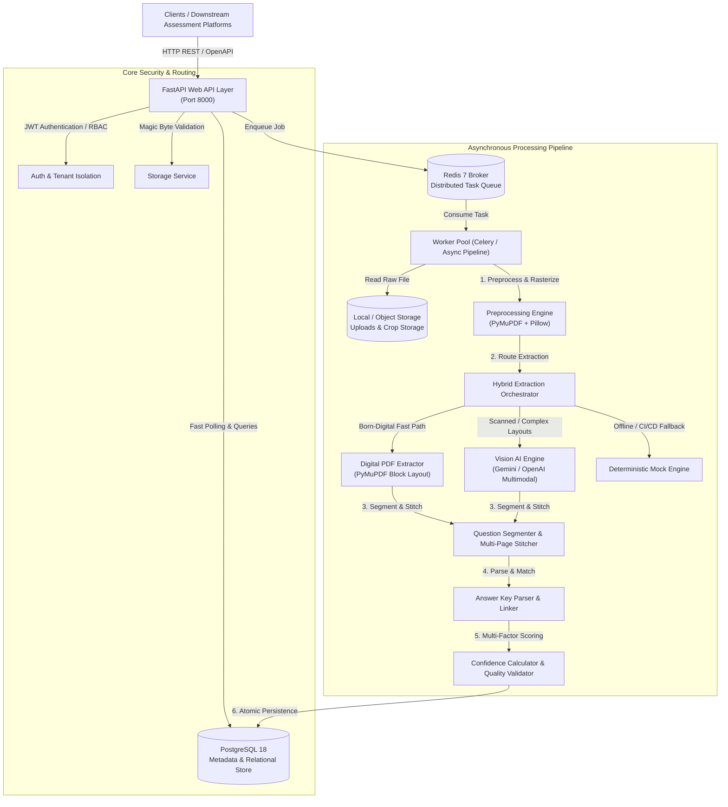
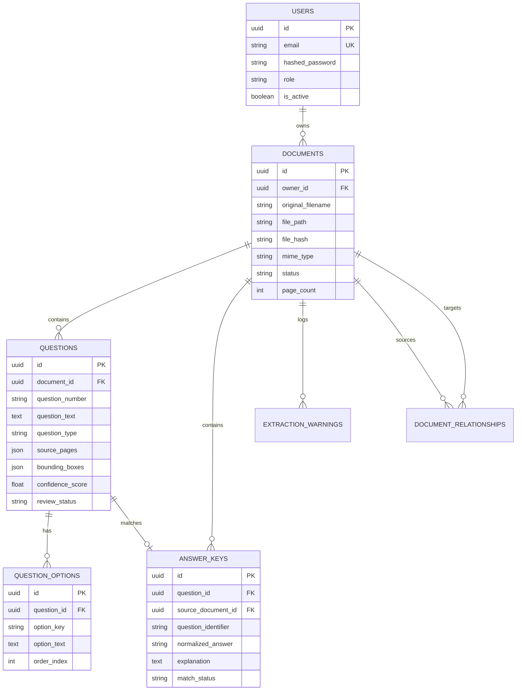

# Architecture & Technical Design Document

## Document Intelligence & Question Extraction Service

---

## 1. Executive Summary & Overall Architecture

The **Document Intelligence & Question Extraction Service** is a scalable, resilient distributed system designed to convert unstructured, heterogeneous examination and assessment material (born-digital PDFs, scanned documents, low-quality multi-page papers, and images) into clean, machine-readable, structured question-and-answer datasets.

### High-Level Architecture Diagram (C4 Container View)



---

## 2. Document Processing & Preprocessing Approach

Examination documents vary significantly across sources—from born-digital vector PDFs to rotated, skewed, low-contrast smartphone photographs. The ingestion pipeline handles this through a multi-stage process:

1. **Binary Magic Byte Inspection**:
   Rather than trusting client-provided file extensions or MIME headers (which are trivially spoofed), the system inspects binary magic bytes:
   * **PDF**: Must begin with `b"%PDF-"` (`0x25 0x50 0x44 0x46`).
   * **PNG**: Must begin with `b"\x89PNG\r\n\x1a\n"`.
   * **JPEG**: Must begin with `b"\xff\xd8\xff"`.
2. **Document Structural Inspection**:
   * Inspects character density per page using PyMuPDF (`page.get_text()`).
   * If a document has an average character count $\ge 50$ characters per page, it is classified as a **born-digital PDF**.
   * If text layers are absent or sparse ($< 40$ chars/page), it is classified as a **scanned bitmap**.
3. **Image Normalization**:
   * **Auto-Orientation**: Detects EXIF rotation flags and PyMuPDF rotation tags to normalize pages to $0^\circ$.
   * **Contrast & Edge Enhancement**: Grayscale conversion, contrast stretching (`ImageEnhance.Contrast`), and unsharp masking (`ImageFilter.SHARPEN`) enhance degraded or faded ink scans.
   * **Adaptive Thresholding**: Binarizes noisy backgrounds to separate text cleanly for vision and OCR processing.

---

## 3. OCR & AI Technology Choices

| Technology | Role | Rationale & Trade-offs |
|---|---|---|
| **PyMuPDF (fitz)** | Native PDF Text & Vector Parser | **Advantages**: 10x faster than pure-Python parsers (`pypdf`, `pdfplumber`), extracts font coordinates, layout blocks, and rasterizes pages at 300 DPI.<br>**Trade-off**: Only works for selectable text; cannot read scanned bitmaps on its own. |
| **Pillow (PIL)** | Image Normalization & Cropping | **Advantages**: Pure-Python image enhancement, orientation correction, and diagram extraction without heavy OpenCV binary dependencies. |
| **Multimodal Vision AI (Google Gemini / OpenAI Vision)** | Complex Layout & Multi-Column OCR | **Advantages**: Unmatched ability to parse messy multi-column exam sheets, handwritten diagrams, complex mathematical LaTeX notation, and blurry scans.<br>**Trade-off**: Requires external API credentials and network access. |
| **Deterministic Mock Engine** | Offline / CI/CD Fallback | **Advantages**: Guarantees all test suites and local demonstrations execute with 100% reproducibility without external network dependencies. |
| **Hybrid Orchestrator** | Intelligent Routing | Directs clean digital PDFs to PyMuPDF (0ms latency, zero API cost) and escalates degraded scans or multi-column layouts to Multimodal Vision AI. |

---

## 4. Question Extraction & Multi-Page Stitching Strategy

### Question Boundary Detection
The system employs regular-expression segmenters designed to support diverse international numbering conventions:
* `1.`, `2.`, `10.`
* `Q1.`, `Q. 1:`, `Question 1 -`
* `1)`, `2)`, `[1]`, `[2]`
* Sub-questions: `12(a)`, `3.b`

### Option Extraction with Math & Parentheses Tolerance
Traditional regex patterns that exclude parentheses `[^\(\)]` fail when option text contains parenthetical math expressions like `(A) \sin(x)` or `(B) \cos(x)`.  
Our engine detects **option delimiter positions** across the text interval:
$$\text{Option}_i = \text{Text}[\text{Marker}_i.\text{end} : \text{Marker}_{i+1}.\text{start}]$$
This ensures that mathematical formulas, LaTeX equations, and parenthetical statements within options are preserved without truncation.

### Multi-Page Question Stitching
Examination questions frequently start at the bottom of Page $N$ and continue onto Page $N+1$:
1. If the final question on Page $N$ has no parsed options and ends without terminal punctuation (`?`, `.`, `:`), it is flagged as an open question.
2. The beginning of Page $N+1$ is evaluated to determine whether it completes the stem or supplies options `(A)`, `(B)`, `(C)`.
3. The engine joins the stem and options, records provenance across all originating pages (`source_pages=[N, N+1]`), and logs a `QUESTION_SPAN_PAGES` audit warning for human reviewers.

---

## 5. Answer Key Parsing & Association Engine

The answer key may appear at the start of a document, at the end, in an appendix, or as a completely separate document.

### Supported Formats:
1. **Numbered Lists**: `1. A`, `2. (B)`, `3 - C`, `Q4: D`.
2. **Lists with Explanations**: `1. (A) - Because gravitational acceleration is independent of mass.` $\to$ Normalized to answer `A` with explanatory metadata.
3. **Table/Matrix Grids**: `1 | A | 2 | B | 3 | C | 4 | D`.
4. **True/False**: `1. True`, `2. False`.

### Association Heuristics & Safety (Requirement 4):
* **Fuzzy Identifiers**: Matches `Q1.` with `1` and `Question 1`.
* **Validation Against Question Options**: If an answer key indicates `E`, but the question only provides options `A`, `B`, `C`, `D`, the system **refuses to silently guess**. Instead, it marks the answer as `AMBIGUOUS` and attaches a `CONFLICTING_ANSWER` warning.
* **Cross-Document Association**: When two documents are linked (e.g. `Question Paper.pdf` $\leftrightarrow$ `Answer Key.pdf`), the engine creates a `DocumentRelationship` and resolves foreign-key pointers across documents in PostgreSQL.

---

## 6. Confidence Scoring & Quality Audit Flags

To prevent silent errors from propagating to downstream assessment engines, every extracted question is assigned a multi-factor composite confidence score:

$$S_{\text{composite}} = 0.35 S_{\text{stem}} + 0.35 S_{\text{options}} + 0.15 S_{\text{layout}} + 0.15 S_{\text{answer}}$$

* $S_{\text{stem}}$: Evaluates character length, grammatical termination (`?`, `.`, `:`), and absence of OCR garbage characters or `[unreadable]` markers.
* $S_{\text{options}}$: Evaluates choice count (MCQs with $\ge 4$ distinct options score $1.0$; $3 \to 0.8$; $< 2 \to 0.2$).
* $S_{\text{layout}}$: Evaluates source page tracking and bounding box completeness.
* $S_{\text{answer}}$: Adds $+15\%$ confidence when a validated matching answer key exists.

### Review Queue Classifications:
* **`CONFIDENT`**: Score $\ge 0.80$, all options present, valid grammar.
* **`NEEDS_REVIEW`**: Score $< 0.80$, degraded scan text, blurred segments (`[blurred]`), or conflicting answers.
* **`PARTIAL_EXTRACTION`**: Truncated stems (`...`) or missing options ($< 2$).

Reviewers can inspect the global `/api/v1/review-queue` and approve or resolve flagged questions via `POST /api/v1/questions/{id}/resolve`.

---

## 7. Storage Design & Data Schema

### PostgreSQL Relational Schema



* **Deduplication**: Every upload calculates a SHA-256 hash. If an identical document was already processed by the user, the existing extraction results are returned immediately.
* **Storage Isolation**: Cropped diagrams and figures are stored in `storage/crops/` with unique UUIDs and served statically via `/crops/{filename}`.

---

## 8. Asynchronous Processing & Task Queues

1. **Decoupled Architecture**:
   Heavy extraction workloads (rendering 30 pages, running VLM calls) take between 5 to 30 seconds. Upload endpoints (`POST /api/v1/documents/upload`) immediately return HTTP 202 Accepted with a tracking URL (`/api/v1/documents/{id}/status`), preventing HTTP connection timeouts.
2. **Dual-Mode Dispatcher**:
   * **Production Mode**: Celery worker pool connected to Redis broker (`REDIS_URL`).
   * **Local / Standalone Mode**: FastAPI `BackgroundTasks` automatically executes jobs in-process if Redis is offline during development or evaluation.

---

## 9. Security Considerations

* **Authentication & Authorization**: OAuth2 with JWT Bearer tokens; Role-Based Access Control (`ADMIN`, `REVIEWER`, `USER`).
* **Tenant Isolation**: Queries enforce `owner_id == current_user.id`, ensuring users cannot access documents or extractions owned by others.
* **Path Traversal Defense**: All filenames are stripped of `../` and `\` path traversal characters; physical files on disk use collision-proof UUIDs.
* **MIME Spoofing Defense**: Inspects binary magic byte headers (`%PDF-`, `\x89PNG`, `\xff\xd8\xff`) to reject executables and malicious scripts.
* **Credential Protection**: External AI API keys and database passwords are strictly loaded from environment variables (`.env`) and never committed to version control.

---

## 10. Scalability Considerations & Future Trade-offs

1. **Horizontal Scaling**:
   The FastAPI web layer is completely stateless. Multiple instances can run behind a load balancer (Nginx, AWS ALB, Render Load Balancer).
2. **Worker Elasticity**:
   Celery workers scale independently based on Redis queue depth:
   ```bash
   celery -A app.workers.celery_app worker --concurrency=4 -Q extraction_queue
   ```
3. **Object Storage Transition**:
   The `StorageService` interface abstracts disk operations. In production, local storage can be swapped for Amazon S3 or Google Cloud Storage by updating the storage driver without modifying business logic.
